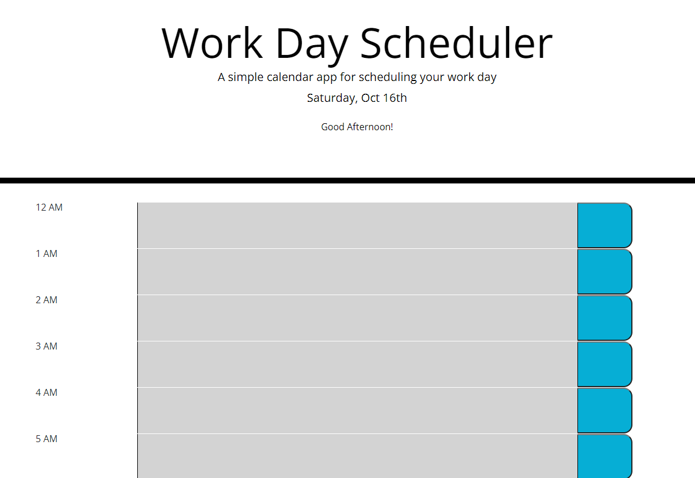

# Day Planner

## About this Project

This project was a lot of fun but also slow going for me. I was stuck on how to recreate sections in jQuery, however when reviewing the classes I was able to understand a bit better and get the practice in. 
This project was to get into the practice of understanding moment.js and jQuery and be able to navigate through the files if I were to go in and see the code. Overall a lot of fun to test out and play around with!

## Built With:
- HTML
- CSS
- Javascript
- Moment.js
- Bootstrap
- jQuery
- Visual Studio Code
- Coffee
- Patience

## Contact:
project link: (https://cpastorelli.github.io/Day-Planner/)

## License

## Acknowledgements
- [Parsing in Moment.js](https://momentjs.com/docs/#/parsing/)
- [Adding Classes jQuery](https://api.jquery.com/addClass/)
- [Appending in jQuery](https://api.jquery.com/append/)
- [BootStrap Grid Layouts](https://getbootstrap.com/docs/4.6/layout/grid/)
- [Splitting Strings](https://www.javascripttutorial.net/javascript-string-split/)
- [headerImage](Photo by Min An from Pexels)

